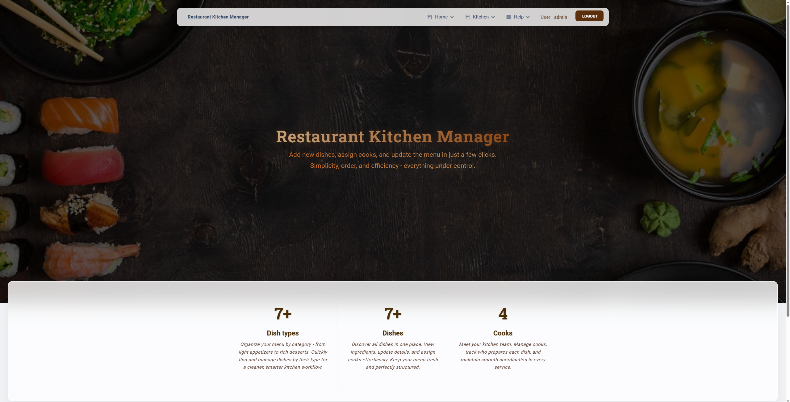
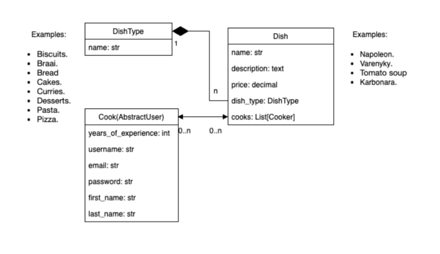

# Restaurant Kitchen Manager
> A Django web application for managing cooks, dishes, and dish types in a restaurant kitchen.

This project helps restaurant managers organize their kitchen efficiently -  
you can manage cooks, add dishes and types, view prices, and browse through data easily with search and pagination.

## Check out the live version of the app:  
[🔗 Visit the Restaurant Kitchen Manager app ](https://restaurant-kitchen-manager-qg1f.onrender.com)

You can log in with the following test user account:  
* Username: admin
* Password: 1qazcde3

## Features

* User login and logout  
* Manage cooks (add, edit, view, delete)  
* Manage dishes and dish types  
* Display dish prices  
* Search and pagination for lists  
* Responsive design using Bootstrap 5  

## Technologies Used

* Python 3
* Django 5
* Bootstrap 5
* HTML / CSS
* SQLite

## Main page


## Installation

A quick guide to set up and run the project locally.

1.Clone the repository:

```shell
git clone https://github.com/irina957/restaurant-kitchen-manager.git
cd restaurant-kitchen-manager
```
2.Create a virtual environment:

```shell
 python -m venv venv
venv\Scripts\activate (Windows)
source venv/bin/activate (macOS)
```
3.Install dependencies:

```shell
pip install -r requirements.txt
```
4.Create and apply migrations:

```shell
python manage.py makemigrations
python manage.py migrate
```
5.Load fixture(Optional):

```shell
python manage.py loaddata kitchen/fixtures/all_data.json
```
6.Run the development server:

```shell
python manage.py runserver
```

### Database structure



